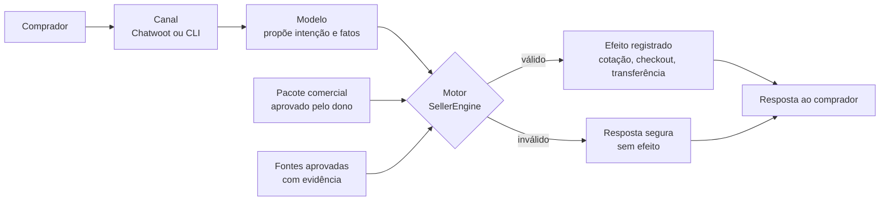
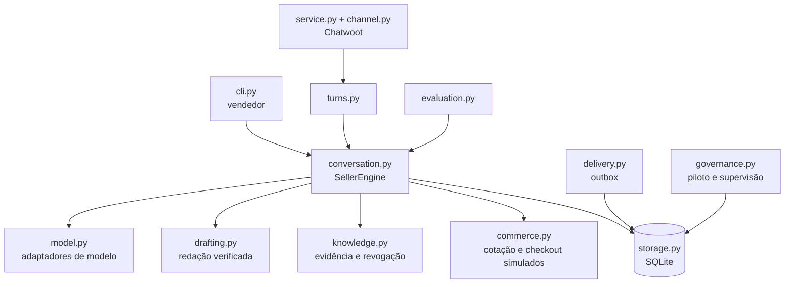

<div align="center">

# Vendedor Adaptável

**Vendedor comercial configurável e local: o modelo interpreta a conversa, e um motor com estado em SQLite decide, autoriza e registra a evidência de cada resposta.**

[](https://github.com/VIDORETTO/entrepreneur-agent/actions/workflows/sales-agent-ci.yml)


[](sales-agent/LICENSE)

[Sobre](#-sobre) · [Instalação](#-instalação) · [Início rápido](#-início-rápido) · [Uso](#-uso) · [Documentação técnica](#-technical-documentation) · [Contribuir](#-contribuindo)

</div>

## 📖 Sobre

O Vendedor Adaptável atende compradores em conversas comerciais (por exemplo, no WhatsApp via Chatwoot) seguindo regras que o **dono do negócio** aprova. Ele serve a quem vende produtos físicos, licenças B2B, serviços sob proposta ou produtos digitais e quer respostas rápidas sem entregar preço, cobrança ou promessa a um modelo de linguagem.

A ideia central: o modelo **propõe** (intenção e fatos da mensagem) e o motor **decide**. Preço, estoque, cotação, checkout, transferência humana e follow-up passam por validação, ficam gravados em SQLite com chave idempotente e só afirmam o que uma fonte aprovada sustenta. Uma proposta inválida do modelo não gera efeito comercial.

Este repositório contém o produto em [`sales-agent/`](sales-agent/README.md), a CLI `vendedor` e a CI.

## ✨ Recursos

- **Quatro modalidades de venda**: físico B2C, oferta B2B padronizada, serviço consultivo e produto digital, com negócios fictícios de demonstração.
- **Configuração pelo dono**: entrevista com checkpoint retomável, pacote comercial versionado, `diff`, simulação em banco temporário, promoção e restauração de versões.
- **Conhecimento com evidência**: cada afirmação traz trecho, `source_id`, versão e localização; a revogação de uma fonte vale na consulta seguinte, inclusive em conversas abertas.
- **Conversa controlada**: pausa por pedido de humano ou recusa, retomada só por comando explícito, correção de pedido que invalida a cotação, redação natural opcional verificada antes da entrega.
- **Canal Chatwoot**: serviço HTTP (`vendedor serve`) com assinatura HMAC com timestamp, reconhecimento do eco das próprias mensagens, janela de 24 h do WhatsApp, anexos e transcrição opcional.
- **Modelo real opcional**: perfis `openai` (Structured Outputs estrito) e `openai-compatible`; sem chave, o adaptador local determinístico funciona.
- **Entrega e efeitos duráveis**: outbox com lease, retry e dead-letter; resultado `unknown` nunca é repetido às cegas.
- **Avaliação reprodutível**: 38 cenários de contrato, conjunto `dev`, conjunto reservado `holdout`, repetição com `pass^k` e relatório com custo e latência.
- **Privacidade local**: exportação e eliminação por contato, retenção configurável (padrão de 180 dias).
- **Uso com agentes de código**: `vendedor skills install` cria `AGENTS.md` e skills para Claude Code, Codex e similares.

## 🧠 Como funciona



1. A mensagem chega e é gravada antes de qualquer processamento.
2. O modelo devolve uma proposta estruturada; o motor a valida contra o pacote, o estado da conversa e as fontes.
3. O efeito (se houver) é gravado com chave idempotente e a resposta entra na fila de entrega.

## 📋 Requisitos

- Python 3.11 ou superior (a CI testa 3.11 e 3.14 e confirma que 3.10 é recusado na instalação).
- O módulo `sqlite3` da biblioteca padrão. Não há dependências de runtime.
- Opcional: uma chave de API compatível com o perfil de modelo escolhido, para o modelo real.

## 📦 Instalação

O pacote ainda não tem publicação em índice de pacotes declarada neste repositório; instale a partir do código-fonte:

```bash
git clone https://github.com/VIDORETTO/entrepreneur-agent.git
cd entrepreneur-agent/sales-agent
python3 -m venv .venv
. .venv/bin/activate
python -m pip install -e .
```

Verifique a instalação:

```bash
vendedor --version
vendedor doctor
```

## 🚀 Início rápido

```bash
vendedor examples          # instala os quatro negócios fictícios em .vendedor-data/
vendedor chat --business-id azul-b2c --conversation-id c1 \
  --contact-id verified:alice --event-id e1 \
  --message "Quero comprar a camiseta azul tamanho M, uma unidade para SP."
```

A resposta traz o preço e um link de checkout **fictício** (`checkout.invalid`), com `charged: false`:

```text
O Camiseta Azul custa R$ 79.00. Você pode concluir aqui: https://checkout.invalid/co_...
```

Para ver as quatro modalidades de uma vez: `vendedor demo`.

## 🧑‍💻 Uso

### Configurar o seu negócio

```bash
vendedor configure start --business-id minha-loja --template physical --material briefing.txt
vendedor configure answer discovery-XXXXXXXX "resposta do dono"
vendedor configure finalize discovery-XXXXXXXX
vendedor export-package --business-id minha-loja --output package.json
```

O `finalize` gera um rascunho seguro, sem preço, estoque ou fonte inventados. Revise o JSON, aumente `package_version`, declare `lifecycle: active` e promova com `vendedor promote-package package.json`. Detalhes em [`docs/CONFIGURATION.md`](sales-agent/docs/CONFIGURATION.md).

### Ajustar com Claude Code, Codex ou outro agente

```bash
vendedor skills install --target all     # claude, codex ou all
vendedor skills status
```

Cria `AGENTS.md` (o texto fora do bloco gerenciado nunca é alterado), `CLAUDE.md` e as skills `seller-*` em `.claude/skills/` ou `.agents/skills/`. Um arquivo que você editou é preservado, salvo `--force`. Comece pedindo ao agente: "use a skill seller-adapt".

### Modelo real e canal

- Modelo: veja [Configuração](#-configuração) e `vendedor model-check --adapter http --config model.json`.
- Canal Chatwoot: `vendedor serve --config service.json`, descrito em [`docs/OPERATIONS.md`](sales-agent/docs/OPERATIONS.md).
- Piloto com compradores reais: `vendedor pilot readiness` exige evidência de modelo e canal reais.

### Medir

```bash
vendedor evaluate --split dev --repeat 4 --output reports/dev.json
```

O conjunto `holdout` só deve ser executado ao final, com `--split holdout`. Veja [`docs/EVALUATION.md`](sales-agent/docs/EVALUATION.md).

## ⚙️ Configuração

Dados privados ficam em `.vendedor-data/` (padrão; altere com `--data-dir`), que não deve ir para o git. Segredos nunca entram em arquivos: configurações usam referências `env:NOME`.

| Variável | Obrigatória | Padrão | Descrição |
|---|---|---|---|
| `OPENAI_API_KEY` | Só com o perfil `openai` | — | Chave do provedor para o modelo real |
| `SELLER_MODEL_NAME` | Só com modelo real | — | Nome do modelo, quando não está no JSON de configuração |
| `SELLER_MODEL_CONFIG` | Não | — | Caminho de um JSON com perfil, modelo, chave `env:NOME` e preços |
| `SELLER_MODEL_PROFILE` | Não | `openai` | `openai` ou `openai-compatible` |
| `SELLER_MODEL_URL` | Só com `openai-compatible` | endpoint da OpenAI no perfil `openai` | Endpoint HTTPS do modelo |
| `SELLER_MODEL_API_KEY` | Só com `openai-compatible` | — | Chave do endpoint compatível |

Exemplo de `model.json` (sem segredo; nome do modelo e preços por milhão de tokens são definidos por você):

```json
{
  "profile": "openai", "model": "NOME_DO_MODELO",
  "api_key": "env:OPENAI_API_KEY",
  "prices": {"input_per_million": 1, "output_per_million": 5},
  "fallback": "rules"
}
```

## ⬆️ Atualização

```bash
git pull
python -m pip install -e .
vendedor storage backup ./backup.sqlite3   # antes de migrar
vendedor doctor
vendedor skills install                    # se usa as skills de adaptação
```

Atualizar o código não sobrescreve `.vendedor-data/`; as migrações do SQLite são versionadas e aditivas.

## 🗑️ Desinstalação

```bash
python -m pip uninstall vendedor-adaptavel
```

Os dados do vendedor (conversas, pacotes, chave de privacidade) ficam em `.vendedor-data/` e só saem se você apagar esse diretório; faça backup antes, pois a eliminação é irreversível. Os arquivos criados por `vendedor skills install` estão listados em `.vendedor-workspace.json`.

## 🛠️ Solução de problemas

| Sintoma | O que fazer |
|---|---|
| `requires a different Python: ... not in '>=3.11'` | Use Python 3.11 ou superior. |
| Dúvida sobre o ambiente | `vendedor doctor` informa Python, SQLite, diretório de dados, modelo e integridade do estado. |
| `/readyz` responde 503 | O serviço informa `storage_integrity_failed` ou `channel_interrupted`; rode `vendedor storage check`. |
| `vendedor evaluate` termina com código 2 | Os limiares de `evaluation/thresholds.json` não foram atendidos; leia o relatório. |
| `vendedor pilot configure --mode pilot` termina com código 2 | Falta prova no portão de prontidão; veja `vendedor pilot readiness`. |

---

# 🔧 Technical Documentation

## 🏗️ Visão técnica

| Camada | Tecnologia |
|---|---|
| Linguagem | Python 3.11+ (sem dependências de runtime) |
| Estado | SQLite com WAL, migração versionada (esquema 14) e busca BM25 via FTS5 quando disponível |
| Canal | Serviço WSGI da biblioteca padrão (`wsgiref`) para o webhook do Chatwoot |
| Modelo | Adaptador HTTP via `urllib` (perfis `openai` e `openai-compatible`) e adaptador local `rules-v1` |
| Testes e lint | pytest, pytest-cov e ruff |
| Empacotamento | setuptools (`python -m build`) |

## 🏛️ Arquitetura



O motor é a autoridade. O modelo, o redator e o transcritor só propõem. A decisão de arquitetura está no [ADR 0001](sales-agent/docs/adr/0001-runtime-local-portable.md).

## 📁 Estrutura do projeto

```text
.
├── .github/
│   ├── workflows/sales-agent-ci.yml   # CI
│   └── dependabot.yml
└── sales-agent/
    ├── src/sales_agent/               # runtime e CLI
    ├── tests/                         # testes pela interface pública
    ├── skills/                        # skills de configuração, conversa e adaptação
    ├── evaluation/                    # conjuntos dev, holdout e de recuperação
    ├── schemas/                       # contratos JSON do pacote e do evento
    ├── examples/                      # negócios fictícios
    ├── docs/                          # instalação, configuração, operação, avaliação
    └── specs/                         # esforços de desenvolvimento e evidências
```

## 🧑‍🔧 Desenvolvimento

```bash
cd sales-agent
python3 -m venv .venv && . .venv/bin/activate
python -m pip install -e ".[dev]"
```

| Comando | Finalidade |
|---|---|
| `python -m pytest -q` | Executa a suíte |
| `python -m pytest -q --clock-shift-days=400` | Executa a suíte com a data do processo deslocada |
| `ruff check .` | Lint |
| `python -m build` | Gera sdist e wheel |
| `python -m twine check dist/*` | Valida os metadados da distribuição |

## 🧪 Testes

Os testes exercitam o comportamento pela interface pública, com SQLite temporário real; dublês só substituem relógio, servidor Chatwoot, servidor do modelo, transcritor e aleatoriedade. A cobertura mínima configurada é de 75% (`--cov`).

## 🔁 CI/CD

O workflow [`sales-agent-ci.yml`](.github/workflows/sales-agent-ci.yml) roda em push e pull request que alteram `sales-agent/` e tem quatro jobs:

- `test`: Python 3.11 e 3.14 com `vendedor doctor`, `ruff`, `pytest --cov`, `vendedor demo`, `vendedor model-check` e `vendedor evaluate`;
- `distribution`: `python -m build`, `twine check` e instalação da wheel;
- `shifted-clock`: suíte com data deslocada em 400 dias;
- `reject-unsupported-python`: confirma que a instalação em Python 3.10 é recusada.

Não há etapa de publicação ou deploy no workflow.

## 🔐 Segurança

Para reportar uma vulnerabilidade, siga [`SECURITY.md`](sales-agent/SECURITY.md) e não publique detalhes sensíveis em issues públicas. O código não guarda segredos em arquivos de configuração (referências `env:NOME`), a assinatura do webhook é verificada com tolerância de tempo e o diretório de dados é restrito ao usuário em sistemas POSIX.

## ⚠️ Limitações

- Não há cobrança real: o comércio é simulado e `charged` é sempre `false`.
- O único canal implementado é o Chatwoot; templates HSM do WhatsApp não fazem parte do serviço.
- A integração com o Farol estável está bloqueada até haver versão e cliente publicados; o backend local `sqlite-farol-v1` não é apresentado como essa integração.
- A avaliação `dev` e `holdout` cobre os quatro negócios fictícios; para o seu negócio, a sondagem via `--package` valida a instalação, e casos próprios ficam por sua conta.
- Um piloto com compradores reais exige evidência executada de modelo e canal reais; sem ela o portão de prontidão bloqueia.

---

## 🗺️ Roadmap

Os candidatos e o estado de cada um estão em [`sales-agent/roadmap.md`](sales-agent/roadmap.md).

## 🤝 Contribuindo

Leia [`CONTRIBUTING.md`](sales-agent/CONTRIBUTING.md) e o [`CODE_OF_CONDUCT.md`](sales-agent/CODE_OF_CONDUCT.md). Mudanças de comportamento precisam de um teste que falhe sem a correção; não use dados reais, segredos ou conversas de clientes em código, testes ou issues.

## 💬 Suporte

Abra uma [issue](https://github.com/VIDORETTO/entrepreneur-agent/issues). Para segurança, use o canal descrito em [`SECURITY.md`](sales-agent/SECURITY.md).

## 📜 Versões

Veja o [`CHANGELOG.md`](sales-agent/CHANGELOG.md).

## 🙏 Agradecimentos

O projeto referencia, com licença MIT e revisão fixada em [`manifest.json`](sales-agent/manifest.json): [`coreyhaines31/marketingskills`](https://github.com/coreyhaines31/marketingskills), [`mattpocock/skills`](https://github.com/mattpocock/skills) e [`VIDORETTO/farol-rag-skill-docs`](https://github.com/VIDORETTO/farol-rag-skill-docs). Atribuições em [`THIRD_PARTY_NOTICES.md`](sales-agent/THIRD_PARTY_NOTICES.md).

## 📄 Licença

Distribuído sob a licença MIT. Veja [`LICENSE`](sales-agent/LICENSE).
