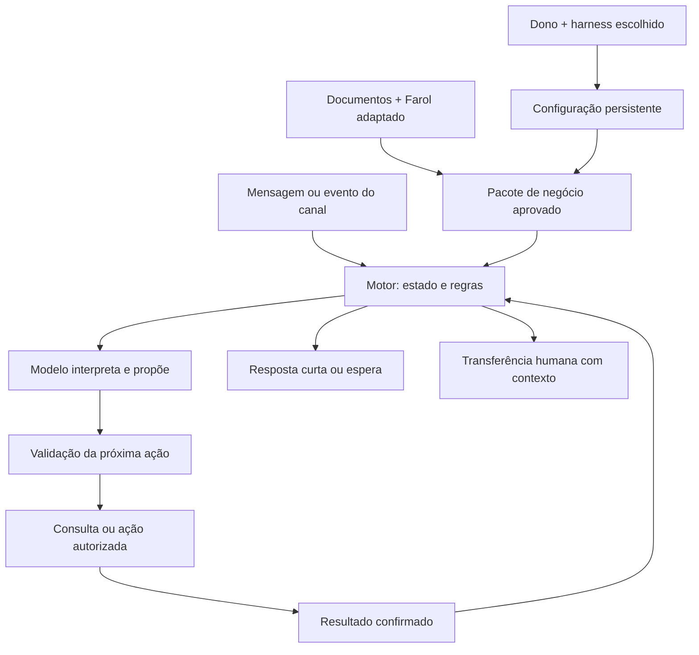

# Vendedor Adaptável — planejamento completo, revisão 3

**Data:** 17/09/2026. **Estado:** proposta de produto e desenvolvimento, fundamentada em pesquisa; não é um sistema implementado nem um resultado comprovado de conversão. Substitui a revisão 2, adotando Corey diretamente como biblioteca comercial e Matt diretamente para a entrevista, mantendo instalação completa, portabilidade e controle de conversa.

## 1. O produto que vamos construir

Um sistema instalável de atendimento comercial que o dono configura conversando com o harness de sua preferência. O sistema transforma informações, documentos e decisões do dono em um pacote persistente de negócio: ofertas, regras, conhecimento, skills selecionadas, integrações permitidas, exemplos de conversa e testes.

O vendedor usa esse pacote para atender. Deve descobrir somente o necessário, responder ao que foi perguntado, reconhecer intenção de compra e executar o próximo passo útil. Se já puder fechar, fecha pelo mecanismo autorizado. Se precisar de um dado, pede esse dado. Se precisar aguardar, aguarda. Se precisar de uma pessoa, transfere com contexto.

**Princípio central:** o objetivo é ajudar o cliente a tomar e concluir uma decisão adequada, com o menor atrito necessário. A quantidade de conversa não é medida de sucesso. Uma conversa curta que omite uma condição importante também é uma falha.

O comportamento será composto por cinco dimensões: negócio, oferta, modalidade de venda, intenção atual e permissões operacionais. B2B/B2C e físico/digital/serviço ajudam a selecionar regras, mas não determinam um roteiro fixo. Uma empresa pode comprar um item padronizado diretamente; uma pessoa física pode precisar de diagnóstico e proposta complexa.

O Farol será parte adaptável da solução. Podemos alterar seus contratos e acrescentar recursos comerciais. Vamos preservar o que já é útil — rastreabilidade, preparação, avaliação e controle dos artefatos — sem obrigar o novo produto a reproduzir limitações de sua interface atual.

## 2. Como usar os documentos deste planejamento

- **Este plano:** decisões de produto, arquitetura, escopo, etapas e prioridades.
- **pesquisa-agentes-de-vendas.md:** fontes consultadas, relatos, limitações da evidência, repositórios e versões inspecionadas. Os identificadores E01–E12 e R01–R08 citados aqui apontam para esse dossiê.
- **contrato-comportamental-vendas.md:** requisitos FR e cenários AC observáveis. É a referência para implementar e verificar o comportamento.
- **briefing-do-negocio.md:** roteiro adaptativo de configuração, que o harness aplica progressivamente; não é um formulário que o dono precisa preencher inteiro de uma vez.

As estruturas de pastas, contratos e scripts abaixo são propostas. Não foram implementados nesta entrega. As metas de qualidade também são critérios propostos, não resultados de testes executados.

## 3. O que a pesquisa mudou na solução

A pesquisa encontrou problemas recorrentes de perda de estado, perguntas repetidas, etapas operacionais puladas, respostas duplicadas e transferências sem contexto. Encontrou também projetos que crescem para dezenas de nós enquanto as regras continuam implícitas no prompt. Os relatos são úteis para construir testes, mas não demonstram por si só que uma arquitetura ou ferramenta vende mais. As evidências e ressalvas estão no dossiê.

Cinco decisões decorrem disso:

1. **Estado explícito:** guardar fatos, intenção, impedimentos e ações em andamento; não tentar reconstruir tudo apenas do histórico textual. E01, E02, E05 e E06.
2. **Perguntas justificadas:** toda pergunta precisa destravar uma decisão, uma recomendação pedida ou uma execução. Uma lista de qualificação não justifica interromper um comprador decidido. E01 e contrato comportamental; biblioteca selecionada em R05.
3. **Efeitos controlados:** pré-requisitos, idempotência, validade de cotação e confirmação de resultado pertencem ao motor e aos conectores. E02, E03, E04 e E07.
4. **Configuração durável:** o resultado da entrevista deve funcionar fora da sessão original e sobreviver à troca de harness. R01–R02 e análise do Farol.
5. **Portabilidade demonstrada:** independência de fornecedor é objetivo arquitetural; autonomia comercial depende de testes de capacidade do modelo, harness e integrações escolhidos.

Não recomendamos adotar n8n apenas porque há muitos relatos nessa comunidade. O aprendizado reaproveitável está nos problemas e nos controles. A escolha do orquestrador continua subordinada à simplicidade operacional.

## 4. Duas conversas diferentes

**Conversa de configuração, com o dono:** pode aprofundar estratégia, confrontar contradições, pedir exemplos, estudar documentos e discutir preferências. Usa diretamente grill-me/grill-with-docs e suas dependências do Matt, com o perfil comercial descrito na seção 5. Produz decisões e artefatos revisáveis.

**Conversa comercial, com o comprador:** é orientada à necessidade atual e ao próximo passo. Não expõe o processo interno de configuração, não entrevista o cliente por curiosidade e não aplica o estilo de grilling.

As skills de configuração não ficam habilitadas no atendimento. O cliente não deve conseguir mudar políticas, instalar plugins ou alterar a configuração do vendedor por uma mensagem. Conteúdo de documentos e mensagens é dado, não autoridade para mudar regras.

## 5. Skills selecionadas e origem direta

**Decisão da revisão 3:** usar diretamente [coreyhaines31/marketingskills](https://github.com/coreyhaines31/marketingskills), R05, como biblioteca comercial principal, e [mattpocock/skills](https://github.com/mattpocock/skills), R02, para a entrevista do dono. Sales-Skills deixa de integrar a seleção. R04 e R06 permanecem referências da pesquisa, sem dependência de instalação no pacote inicial. A decisão simplifica procedência, atualização e curadoria; não pressupõe uma conclusão sobre autoria ou cópia entre repositórios.

### 5.1 Núcleo comercial do Corey

Selecionar quatro skills para configurar e preparar todo negócio, aplicando somente as partes pertinentes à modalidade:

- **[product-marketing](https://github.com/coreyhaines31/marketingskills/blob/5b2c0007766c6a1cf1d53fd8fc73e979e0821022/skills/product-marketing/SKILL.md):** construir o contexto compartilhado de oferta, público, diferenciais, linguagem e limitações. Saída: contexto aprovado e versionado, compatível com o perfil do negócio. Não manter duas cópias editáveis e divergentes; definir uma fonte canônica e gerar a representação esperada pela skill.
- **[sales-enablement](https://github.com/coreyhaines31/marketingskills/blob/5b2c0007766c6a1cf1d53fd8fc73e979e0821022/skills/sales-enablement/SKILL.md):** preparar playbook, respostas a objeções, evidências e materiais/propostas quando necessários. Usar as referências distribuídas com a skill. Adaptar o viés B2B ao negócio; não obrigar apresentação, prova de ROI ou pergunta de continuidade em todo atendimento.
- **[revops](https://github.com/coreyhaines31/marketingskills/blob/5b2c0007766c6a1cf1d53fd8fc73e979e0821022/skills/revops/SKILL.md):** desenhar fases, critérios de passagem, roteamento e transferência. Saída: política estruturada do negócio. Funis complexos, pontuação de lead e MQL/SQL só entram quando úteis; compra direta continua sem qualificação adicional.
- **[copy-editing](https://github.com/coreyhaines31/marketingskills/blob/5b2c0007766c6a1cf1d53fd8fc73e979e0821022/skills/copy-editing/SKILL.md):** revisar exemplos e modelos de resposta para clareza e concisão. Usar durante configuração/manutenção; não executar todas as passagens editoriais em cada mensagem de cliente.

Essas quatro skills preparam artefatos para o vendedor. Não constituem, por si só, um controlador de atendimento em tempo real. O catálogo inspecionado não oferece equivalentes diretos, com os mesmos nomes, para todas as skills de memória, intenção e fechamento listadas na revisão anterior.

### 5.2 Skills condicionais do Corey

Distribuir no catálogo selecionável, com ativação justificada pelo negócio:

- **customer-research:** quando houver entrevistas, avaliações, tickets ou conversas autorizadas a analisar. Saída: linguagem, necessidades e objeções sustentadas por evidência. Não tornar pesquisa extensa requisito de toda instalação.
- **offers:** quando o dono precisar estruturar ou melhorar a oferta. Não permitir que o vendedor invente bônus, garantia, escassez ou condições durante o atendimento.
- **competitors:** quando comparações comerciais forem relevantes. Preparar respostas com fontes e limitações reais; não exigir criação de páginas SEO para responder a um comprador.
- **pricing:** quando o dono precisar discutir preço ou planos. A skill é orientada a estratégia de SaaS, portanto só usar com adequação explícita; não substitui consulta de preço atual nem autorização para desconto.
- **emails:** quando houver follow-up por e-mail aprovado. Usar para preparar a sequência; elegibilidade, cancelamento e envio pertencem ao motor e ao conector.
- **sms:** somente se SMS/MMS fizer parte do canal escolhido. Não tratá-la como skill de WhatsApp nem transplantar regras de uma jurisdição para outra.
- **churn-prevention:** para negócios recorrentes que precisem de retenção ou recuperação de pagamento. Não criar obstáculos ao cancelamento nem insistir depois da recusa.

As skills condicionais estão no mesmo [snapshot de skills do Corey](https://github.com/coreyhaines31/marketingskills/tree/5b2c0007766c6a1cf1d53fd8fc73e979e0821022/skills). SEO, anúncios, campanhas sociais, prospecção fria e outras áreas ficam fora da seleção inicial de atendimento. Podem ser avaliadas em uma expansão de escopo, sem aumentar o contexto do vendedor agora.

### 5.3 Entrevista diretamente das skills do Matt

Usar as fontes originais, não uma reimplementação intermediária do Hybrid:

- **[grill-me](https://github.com/mattpocock/skills/blob/74ca5fe077456a0b3b2f5310cf9430999fd0b5fd/skills/productivity/grill-me/SKILL.md):** entrada para explorar uma decisão ou plano.
- **[grill-with-docs](https://github.com/mattpocock/skills/blob/74ca5fe077456a0b3b2f5310cf9430999fd0b5fd/skills/engineering/grill-with-docs/SKILL.md):** entrada preferida quando a entrevista precisa registrar decisões e vocabulário. Este é o nome real no repositório.
- **[grilling](https://github.com/mattpocock/skills/blob/74ca5fe077456a0b3b2f5310cf9430999fd0b5fd/skills/productivity/grilling/SKILL.md):** dependência que contém a entrevista por decisões e suas dependências.
- **[domain-modeling](https://github.com/mattpocock/skills/blob/74ca5fe077456a0b3b2f5310cf9430999fd0b5fd/skills/engineering/domain-modeling/SKILL.md):** dependência documental de grill-with-docs; organizar vocabulário e decisões relevantes sem exigir um ADR para cada preferência de tom.

Preservar origem e revisão; os dois atalhos sozinhos não bastam, pois chamam as dependências. O adaptador do nosso produto resolve essas chamadas quando o harness não tem uma ferramenta chamada `Skill`. Pesquisa de fatos pode ser local ou delegada conforme a capacidade disponível.

A versão original de grilling pede a rodada inteira de decisões disponíveis e conclusão por entendimento compartilhado. Nossa configuração comercial aplica um perfil explícito: rodadas pequenas, escopo limitado à capacidade em configuração, checkpoint e revisão do pacote antes da ativação. Essas diferenças devem estar documentadas, não atribuídas ao Matt como se fossem instruções originais. Nenhuma skill de grill é carregada para conversar com compradores.

Seu hybrid-spec-kit continua disponível para especificar, planejar, implementar e verificar o desenvolvimento do sistema. Não será uma segunda entrevista obrigatória depois da entrevista do Matt.

### 5.4 O que continua próprio do sistema

Manter as skills internas propostas de conversa, recomendação, objeção, fechamento e transferência, alimentadas pelos artefatos aprovados do Corey e pelas fontes do negócio. Seus nomes no projeto não representam skills já existentes no repositório do Corey.

O motor próprio controla estado, necessidade de pergunta, avanço direto, condições de compra, permissões, confirmação de ações, concorrência e espera. As regras e testes existentes permanecem válidos após a troca da biblioteca. Não tentar substituir esses controles apenas por revops ou por um playbook.

### 5.5 Versionamento e distribuição

Corey e Matt têm licença MIT nos snapshots inspecionados. Fixar as revisões no manifesto, preservar licença e atribuição e distribuir referências/scripts necessários às skills selecionadas. Uma referência cruzada a outra skill não obriga instalar todo o catálogo: o compilador registra a dependência real ou delimita a funcionalidade indisponível.

Instalação completa significa recursos disponíveis para configuração e atendimento; carregamento em contexto continua seletivo. Farol R08 prepara e recupera o conhecimento aprovado. SalesGPT R07 permanece somente como referência histórica da pesquisa.

## 6. Configuração pelo harness: descobrir sem cansar o dono

### 6.1 Começar por evidências

O harness lê os documentos indicados e produz uma síntese: ofertas, compradores, formas de fechamento, regras operacionais e lacunas. Cada item recebe estado `confirmado`, `inferido`, `conflitante` ou `ausente`, com origem. Inferência pode orientar uma pergunta; não pode virar política de cobrança silenciosamente.

Em seguida apresenta a síntese para correção e prioriza decisões que afetam a primeira operação desejada. Não começa com quarenta perguntas genéricas. As perguntas do briefing são um banco de possibilidades.

### 6.2 Entrevista em rodadas pequenas

- Fazer uma pergunta decisiva por rodada; agrupar até três quando forem independentes e fáceis de responder.
- Não pedir o que já está claramente respondido em fonte aprovada.
- Apresentar opções quando isso reduzir esforço, permitindo resposta livre.
- Explicar o efeito da escolha: “se o preço depende da visita, podemos agendar, mas não prometer orçamento fechado”.
- Pedir exemplos de atendimento desejado e indesejado; transformar preferência vaga em resposta concreta.
- Permitir “não sei”, pular item não bloqueante e retomar depois.
- Salvar estado da descoberta, decisões e pendências a cada rodada útil.

A entrevista termina quando há evidência suficiente para a capacidade que será ativada, não quando todas as possíveis perguntas acabaram. Aprofundamento estratégico fica disponível, sem bloquear uma instalação simples.

### 6.3 Ativação por capacidade

Falta de política de desconto não impede responder perguntas sobre ofertas com preço confirmado. Impede conceder descontos. Falta de gateway não impede explicar condições ou encaminhar uma proposta, mas impede anunciar checkout concluído. Falta de regra de prazo impede prometer entrega.

O pacote deve declarar `habilitado`, `assistido`, `desabilitado` ou `pendente` por capacidade, com motivo. Antes de operar sozinho, o dono vê exemplos de resposta, ações permitidas, limitações e resultados das simulações.

### 6.4 Resultados persistentes

Gerar perfil do negócio, catálogo normalizado, políticas, modalidades de venda, regras de conversa, matriz de capacidades, fontes aprovadas, configuração de integrações sem segredos, skills selecionadas, cenários esperados e pendências. Segredos ficam em armazenamento próprio. Uma sessão futura deve retomar pelos arquivos e pelo estado, sem depender da memória da conversa original.

## 7. Modelo comercial: fase, prontidão e operação são coisas distintas

Não criar um único campo “fase” tentando representar tudo. Registrar separadamente:

- **Contexto:** empresa configurada, canal, contato e oportunidade/pedido em questão.
- **Oferta:** físico, digital ou serviço; variante, quantidade e condições relevantes.
- **Modalidade:** compra direta, recomendação assistida, orçamento, contratação ou agendamento.
- **Fase comercial:** explorando, avaliando, pronto para avançar, ação em andamento, concluído, adiado, encerrado sem venda ou transferido.
- **Prontidão:** evidência explícita do que a pessoa quer fazer; pode existir com impedimentos operacionais.
- **Impedimentos:** dado faltante, dúvida, dependência de consulta, autorização ou indisponibilidade.
- **Operação:** nenhuma, cotação válida, checkout criado, pagamento pendente/confirmado, proposta enviada, agenda confirmada etc.
- **Responsável:** IA, pessoa ou fila aguardando pessoa.

Essas fases não são uma escada obrigatória. Uma primeira mensagem pode ser “quero comprar o pacote anual”. Uma pessoa avaliando pode estar pronta para agendar, mas não para contratar. Um pedido pago pode gerar suporte e, em outro momento, uma nova compra.

Avanço exige sinal verificável: escolha, confirmação, solicitação explícita ou evento operacional. Interesse presumido e nota numérica do modelo não bastam. Uma mudança de etapa não apaga os fatos anteriores.

O registro mínimo inclui fatos com origem e data, questões já respondidas, objetivo atual, próximo passo permitido, impedimentos, cotação e sua versão, ação pendente, autorizações, última interação, tarefas futuras e resumo factual. Em B2B, contato e oportunidade são entidades distintas; a manifestação de uma pessoa não implica autorização de todos os envolvidos.

## 8. Política de conversa: as regras que mais importam

### 8.1 Ordem de decisão

Em cada mensagem, interpretar todas as intenções relevantes e aplicar prioridade:

1. Respeitar pausa humana, pedido para parar e restrições vigentes.
2. Processar cancelamentos e correções que invalidam uma ação pendente.
3. Atender pedido de humano e problemas que exigem suporte ou tratamento específico.
4. Diante de pedido explícito de avanço, verificar impedimentos e executar o próximo passo autorizado.
5. Responder perguntas diretas com dados válidos.
6. Fazer descoberta mínima quando necessária à recomendação solicitada.
7. Redirecionar brevemente assuntos sem relação com o negócio, sem discurso ou insistência.

Essa prioridade não deve ignorar a parte de uma mensagem que condiciona a compra. “Quero comprar se chegar sexta” exige verificar a entrega antes de concluir. “Manda o link, mas agora são duas unidades” exige atualizar quantidade e cotação antes do link.

### 8.2 Toda pergunta precisa ter um motivo

Antes de perguntar, o motor deve conseguir identificar: qual campo está faltando; qual decisão muda com a resposta; por que o dado é necessário agora; e por que não pode ser obtido de fonte autorizada ou já existente.

Não perguntar orçamento para informar preço conhecido. Não perguntar cargo para vender uma unidade padronizada. Não perguntar a dor depois que o cliente escolheu o produto. Não repetir dados só para preencher um roteiro. Perguntas de recomendação podem ser úteis, mas devem ser poucas e ligadas à escolha real.

Em chat, priorizar uma decisão por turno. Campos operacionais do mesmo passo podem ser agrupados quando fizer sentido, por exemplo data e horário de uma visita. Um formulário de checkout pode ser melhor que coletar endereço inteiro por mensagens; não coletar novamente o que será solicitado de forma segura no checkout.

### 8.3 Brevidade como qualidade, não como corte de caracteres

Padrão inicial para perguntas simples em chat: uma a três frases, frequentemente até 40–80 palavras. Isso é preferência ajustável, não regra que pode cortar condição material, instrução necessária ou resposta expressamente solicitada.

Responder primeiro ao pedido. Evitar elogios automáticos, apresentação repetida, resumo do próprio raciocínio, slogans, benefícios não pedidos, perguntas de confirmação sem necessidade e CTA em toda mensagem. Não quebrar uma resposta simples em quatro bolhas artificiais.

E-mail pode conter várias perguntas: responder todas de forma organizada. Uma comparação detalhada pedida pelo cliente pode ser longa. O objetivo é eliminar excesso sem reduzir utilidade.

### 8.4 Quando o cliente já quer comprar

Se oferta, condições e dados necessários já estiverem definidos: preparar a ação permitida imediatamente. Não voltar a descoberta, apresentar alternativas ou reargumentar valor.

Se faltar uma variante: pedir a variante. Se o prazo for condição: consultar prazo. Se houver vários itens ambíguos no histórico: esclarecer qual. Se o negócio vende por proposta: produzir a proposta ou encaminhá-la pelo fluxo autorizado; não chamar isso de venda concluída.

Intenção de comprar permite avançar na compra; não significa autorização irrestrita para debitar, aceitar contrato ou mudar condições. O produto deve definir qual confirmação é necessária para cada efeito.

### 8.5 Quando não responder ou não continuar vendendo

Depois de enviar uma ação válida, aguardar quando não houver outra informação útil. Depois de confirmação ou agradecimento, uma breve conclusão pode bastar; não acrescentar “mais alguma coisa?” automaticamente, nem reabrir argumentos.

Recusa explícita encerra a insistência. Pedido de pessoa muda o responsável. Um estado terminal se aplica àquela interação ou operação, não proíbe responder a uma nova intenção futura.

### 8.6 Delimitação de assunto

Compatibilidade, uso, limitações, comparação comercial relevante, garantia, entrega, devolução e suporte relacionado podem ser essenciais à decisão. Não tratá-los como desvio só porque não são um pedido de compra. Se o cliente relata problema no pedido, resolver ou encaminhar antes de tentar vender de novo.

As respostas concretas e os testes para essas regras estão no contrato comportamental.

## 9. Arquitetura simples, com responsabilidades claras



### 9.1 Componentes mínimos

Uma aplicação principal, banco persistente e execução de tarefas em segundo plano quando necessário. O mesmo projeto pode conter os módulos de configuração, conversa, conectores e Farol. Não precisamos iniciar com microserviços, marketplace, múltiplos vendedores autônomos ou uma cadeia de agentes.

Python é uma escolha inicial razoável para aproveitar o Farol. Framework web, banco e infraestrutura devem ser selecionados na fatia de implementação, conforme o modo de implantação. Este planejamento não fixa APIs nem versões sem uma verificação específica de documentação e compatibilidade.

**Uma autoridade para as regras:** políticas estruturadas e código de validação governam transições e ações. O prompt recebe uma representação dessas regras. Não manter uma segunda máquina de estados independente dentro do texto do prompt.

### 9.2 Ciclo de uma mensagem

1. Validar origem do evento, identificar negócio/conversa e deduplicar pelo identificador do canal.
2. Agrupar fragmentos próximos de mensagem com janela curta e limitada, ajustada ao canal; não simular atraso humano artificial.
3. Ler estado e versão da conversa, responsável atual e políticas ativas.
4. Recuperar somente os fatos, skills e evidências necessários à intenção atual.
5. Pedir ao modelo interpretação e proposta estruturadas: intenção, fatos novos, pergunta ou ação candidata e impedimentos.
6. Validar contra regras, evidências e capacidades. Ausência de requisito bloqueia a ação, mesmo se o modelo insistir.
7. Consultar dados operacionais ou executar ação permitida; registrar resultado confirmado, pendente, falho ou desconhecido.
8. Produzir resposta apoiada no resultado, ou optar por aguardar/transferir.
9. Antes do envio, verificar se chegaram correções ou se uma pessoa assumiu a conversa; resposta obsoleta não deve ser enviada.
10. Persistir estado, eventos, fila de saída e tarefas futuras com controles para evitar duplicação.

Uma conversa simples pode usar uma chamada ao modelo. Uma consulta pode exigir outra chamada ou uma resposta determinística curta. Não impor duas ou cinco chamadas a todos os turnos. Permitir correção limitada de saída inválida; depois disso, resposta segura ou atendimento assistido, sem loop infinito.

Validar números e condições operacionais por dados estruturados sempre que possível. Um segundo modelo “juiz” pode ajudar a avaliar estilo, mas não garante que um pagamento, preço ou estoque seja verdadeiro.

## 10. Harness e modelo: independência com limites verificáveis

O sistema terá um núcleo portátil: Markdown, referências, exemplos, schemas, scripts documentados e estado persistente. A especificação [Agent Skills](https://agentskills.io/specification) é uma referência útil para empacotamento e carregamento progressivo. Isso não torna ferramentas específicas de um harness automaticamente compatíveis com outro.

Definir três níveis:

- **Leitura e assistência:** um modelo lê o pacote e ajuda o dono, sem autonomia operacional.
- **Configuração:** o harness lê/escreve os arquivos necessários, executa os validadores disponíveis e salva o pacote.
- **Atendimento autônomo:** um adaptador de execução mantém eventos, estado, ferramentas e permissões, e passa nos testes comerciais e operacionais.

O dono pode usar um modelo para configurar e outro para atender. O vendedor deve funcionar sem deixar aberta a conversa de configuração. O runtime pode usar API local ou remota; reutilizar um harness via CLI só se sua interface, execução não interativa, permissões e condições de uso sustentarem esse funcionamento. Não presumir que uma assinatura de chat fornece a mesma capacidade de uma API.

“Qualquer modelo” significa não haver dependência estrutural de um fornecedor, não prometer que todos os modelos conseguem operar com a mesma qualidade. Modelos incapazes de seguir contratos de ação podem permanecer no modo assistido. Não liberar ações porque “normalmente o JSON vem certo”.

Cada combinação será registrada por modelo, versão, adaptador, harness de configuração e conjunto de testes. Trocar o modelo ou o template invalida a evidência de compatibilidade pertinente e exige reavaliação. Só publicar suporte como testado quando tiver sido efetivamente demonstrado.

## 11. Estrutura proposta do projeto e instalação

```text
vendedor-adaptavel/
  README.md
  AGENTS.md
  LICENSE
  THIRD_PARTY_NOTICES.md
  manifest.json
  skills/
    sales-setup/
      SKILL.md
      references/
      examples/
      scripts/
    sales-business-discovery/
    sales-policy-design/
    sales-knowledge-preparation/
    sales-simulate/
    sales-maintain/
    seller-conversation/
    seller-recommend/
    seller-objection/
    seller-close/
    seller-handoff/
  packs/
    physical/
    digital/
    service/
    direct-sale/
    consultative-sale/
  references/
    conversation-contract.md
    question-policy.md
    evidence-policy.md
  examples/
    b2c-physical-direct/
    b2c-consultative/
    b2b-direct/
    b2b-consultative/
    mixed-business/
  schemas/
  scripts/
  runtime/
  adapters/
    knowledge/
    models/
    channels/
    commerce/
    human-handoff/
  tests/
    contracts/
    conversations/
    integrations/
  docs/
```

Cada skill comercial tem descrição de quando usar, quando não usar, entradas necessárias, regras, referências, exemplos positivos e negativos e cenários de teste. Scripts existem somente quando trazem execução determinística útil. Não criar um script decorativo para cada skill.

Os dados privados do usuário ficam em diretório separado dos componentes atualizáveis: perfil, catálogo, políticas, fontes autorizadas, checkpoints, histórico de versões e resultados. Conversas e segredos não entram nos exemplos do projeto nem são publicados por padrão.

### 11.1 Scripts a implementar

- Diagnóstico da instalação e das capacidades do harness/modelo.
- Validação de perfil, políticas e lacunas por capacidade.
- Preparação e consulta verificável do conhecimento via Farol.
- Compilação do pacote comercial, com referências e versões.
- Simulação de conversas e repetição de casos registrados.
- Testes de compatibilidade de adaptadores e modelos.
- Atualização com preservação de configuração, migração e recuperação.

Os nomes finais e comandos serão definidos na implementação. Não distribuir no planejamento comandos fictícios que aparentem estar prontos.

### 11.2 Instalação e atualização

Instalar primeiro no escopo do projeto/negócio, sem sobrescrever configuração global do harness. O instalador detecta os recursos disponíveis, explica dependências ausentes e habilita adaptadores selecionados. Pacote completo pode conter conectores opcionais sem instalar todos os serviços externos.

O manifesto registra versões, hashes, origem e licença dos componentes. Atualizações distinguem conteúdo do fornecedor de decisões e alterações do usuário. Havendo conflito, preservar a configuração existente e apresentar a diferença; não reescrever políticas silenciosamente.

O fluxo mínimo deve funcionar com um negócio por instalação. Preparar identificadores e fronteiras corretas desde o começo, mas adiar painel SaaS, cobrança por tenant e administração centralizada até haver necessidade demonstrada.

## 12. Como selecionar skills em atendimento

O registro de skills guarda tipos de oferta e modalidade aceitos, intenções cobertas, entradas necessárias, ferramentas exigidas e incompatibilidades. Uma skill só entra se for aplicável ao turno e executável com as capacidades atuais.

O núcleo de conversa é pequeno e sempre disponível. Referências extensas e procedimentos especializados são carregados quando necessários. Uma loja que vende item físico não precisa de instruções de provisionamento de curso digital; uma empresa que vende ambos pode usar packs distintos por oferta.

Precedência: controles operacionais e de permissão; políticas aprovadas do negócio; dados válidos para o fato; preferências de linguagem; orientação geral da skill. Fatos e políticas conflitantes exigem resolução explícita — não escolher o texto que apareceu por último no contexto.

Não buscar e instalar skills públicas durante conversa com cliente. A seleção é feita na configuração e promovida após avaliação. Isso mantém versões, custo, permissões e comportamento revisáveis.

## 13. Como adaptar o Farol

O Farol atual já oferece infraestrutura útil para organizar fontes, preparar artefatos e preservar evidências. Na revisão inspecionada, a geração de skills produz uma estrutura determinística, não uma transformação comercial completa por LLM. A consulta de evidências pode usar um adaptador em memória se nenhum adaptador real for fornecido, e o contrato não deve ser confundido com entrega garantida do texto relevante ao vendedor. Caminhos e versão em R08.

Isso orienta as mudanças seguintes, sem exigir preservação literal da interface atual:

1. **Preset comercial:** separar fatos de oferta, políticas, exemplos de atendimento e conhecimento de produto. Registrar negócio, oferta, versão, vigência, aprovação e origem.
2. **Contrato de recuperação:** retornar trechos autorizados, localizadores, versão e metadados úteis. Se o texto estiver em outra camada, fornecer uma operação explícita para obtê-lo. Um identificador de evidência sozinho não sustenta uma resposta.
3. **Adaptador real obrigatório em produção:** o modo em memória serve a testes/demonstrações; uma verificação de instalação deve detectar quando está sendo usado indevidamente.
4. **Enriquecimento comercial explícito:** o harness/modelo prepara regras e exemplos a partir das fontes; o dono resolve decisões de negócio; validadores verificam estrutura e consistência. Não afirmar que geração determinística entende estratégia sozinha.
5. **Composição e versão:** vincular pacote comercial, fontes, skills, políticas e testes em uma versão promovível e reversível.
6. **Atualização seletiva:** mudar uma política deve mostrar quais respostas e testes dependem dela. Revogação invalida resultados e caches, inclusive em conversas ativas.
7. **Avaliação:** manter perguntas esperadas e casos sem resposta, por negócio e tipo de fonte. Avaliar recuperação e comportamento final separadamente.

O Farol não será fonte de verdade de estoque em tempo real, confirmação de pagamento ou disponibilidade instantânea de agenda. Esses fatos vêm dos sistemas operacionais. RAG explica características e regras aprovadas; ferramentas consultam situação atual; memória descreve a conversa. As três camadas não são intercambiáveis.

Ciclo de publicação: fonte recebida → classificação e conflitos → preparação → revisão das decisões → testes → versão ativa. Documento novo não muda política comercial automaticamente. Ao mesmo tempo, uma fonte revogada deve ser removida de uso imediatamente, sem esperar a próxima grande publicação.

Primeira prova técnica do Farol: consultar um backend real, obter o trecho correto com origem, excluir conteúdo de outro negócio e demonstrar invalidação após revogação. Só depois otimizar busca híbrida, reranking e tamanho de contexto conforme erros medidos.

## 14. Plugins e ferramentas: contratos de ação

Para este produto, plugin é um pacote de capacidades de integração. Pode usar API, MCP ou adaptador próprio, sem exigir que todo harness implemente o mesmo protocolo. Os primeiros contratos são catálogo/preço, checkout ou proposta, agenda quando aplicável, canal e transferência humana.

Cada ação declara entradas, pré-requisitos, efeitos, permissões, chave de idempotência e saída tipada. Os resultados distinguem `confirmado`, `pendente`, `falhou` e `desconhecido`. Um timeout após solicitar um pagamento não autoriza repetir a criação às cegas: consultar o estado antes de tentar novamente.

Uma cotação deve ter identificador, oferta/variante, quantidade, moeda, componentes do preço, condições de pagamento, validade e origem. Mudança de quantidade, prazo ou forma de pagamento exige recalcular o que depende disso. Uma confirmação antiga não autoriza uma condição nova.

O conector pode encapsular passos internos: localizar/criar cliente de modo válido, verificar preço e gerar checkout. O modelo não precisa escolher livremente a ordem de cada chamada. IDs vêm de consulta confirmada, não da geração de texto.

Estoque deve ser revalidado e reservado de forma compatível com compras concorrentes quando necessário. Agenda só está confirmada após confirmação do provedor. Link emitido, pagamento aprovado e pedido entregue são estados diferentes. Comprovante enviado pelo cliente é evidência a verificar, não confirmação automática.

As permissões distinguem consultar, preparar, enviar e executar efeitos financeiros/contratuais. Definir isso por capacidade na configuração. O vendedor não negocia fora de faixas aprovadas nem inventa escassez, desconto ou promessa para conseguir fechamento.

## 15. Memória, concorrência e transferência

Guardar histórico, resumo factual e campos estruturados. Resumos precisam preservar correções e origem; não devem manter valores substituídos como se ainda fossem atuais. Limitar o contexto enviado ao modelo sem apagar o estado necessário à operação.

A identidade inclui negócio, canal, contato e oportunidade. Unificar canais somente por identidade verificada. Telefone compartilhado e mais de uma compra da mesma pessoa exigem distinguir operação, não fundir tudo em uma sessão indefinida.

Serializar mudanças por conversa ou usar controle de versão equivalente. Deduplicar eventos e operações. Se uma correção chega enquanto a resposta é preparada, invalidar a resposta que depende do dado antigo. Se a ação já produziu efeito, tratar compensação ou suporte; não fingir que nunca ocorreu.

Quando uma pessoa assume, o motor pausa o vendedor e revalida/cancela tarefas pendentes. Transferir resumo factual, pedido atual, fatos confirmados, impedimento, ações realizadas e acesso ao histórico. Não transferir apenas um resumo que pode esconder a condição decisiva.

Fora do horário humano, informar a disponibilidade real e registrar a solicitação. Não prometer atendimento imediato nem voltar a vender para disfarçar a fila. A retomada pela IA depende de regra ou liberação explícita, não de um temporizador arbitrário.

## 16. Follow-up, objeções e encerramento

Follow-up é uma capacidade configurável, com motivo, elegibilidade, canal permitido, horário, limite e cancelamento. Antes de enviar, verificar novamente se houve resposta, compra, recusa, transferência ou mudança do pedido. Uma mensagem planejada ontem pode ser inadequada hoje.

Silêncio não é objeção identificada. “Está caro” permite esclarecer valor/alternativa pertinente; “não quero, pare de mandar mensagem” exige encerrar contato, não trocar canal. Não ativar cadência universal para todos os negócios.

Tratar objeções com resposta específica e evidência relevante. Não despejar argumentos, pressionar por urgência falsa ou sempre terminar com outra tentativa de fechamento. Quando a alternativa mais adequada for não comprar aquela oferta, o vendedor deve dizer isso.

Postergar e encerrar são resultados legítimos. O sistema registra motivo quando disponível sem obrigar a pessoa a justificar recusa.

## 17. Avaliação: provar comportamento antes de buscar escala

### 17.1 Conjunto inicial proposto

Construir 80 cenários com variações de linguagem e sequência:

- 16 de compra direta, avanço e salto de etapas.
- 12 de preço, concisão, foco e perguntas necessárias.
- 12 de combinações B2B/B2C, ofertas e modalidades.
- 12 de memória, correções e retorno posterior.
- 12 de ações, repetição de eventos, falhas e concorrência.
- 8 de pessoa no atendimento, recusa e follow-up.
- 8 de instalação, configuração e portabilidade.

Separar 50 para desenvolvimento e 30 reservados para avaliação. Acrescentar paráfrases e múltiplas execuções nos pontos sujeitos a variabilidade. Não ajustar repetidamente o prompt olhando apenas o conjunto reservado.

Os 38 cenários AC do contrato são a semente, não o total desses 80 testes. Cada caso registra entrada, estado anterior, ferramenta disponível, resposta/ação esperada, ações proibidas e evidências da execução. Julgar a trajetória, não somente a última mensagem.

### 17.2 Critérios iniciais de liberação

- Zero violações críticas observadas no conjunto executado: operação não autorizada, dado de outro negócio, pagamento duplicado ou insistência após recusa.
- Zero qualificação desnecessária nos casos de compra pronta e zero repetição injustificada dos campos já disponíveis.
- Pelo menos 90% de próximos passos corretos no conjunto comercial, apresentando numerador/denominador e falhas, não só percentual.
- Toda informação crítica de preço, prazo ou condição apoiada em fonte válida ou retorno operacional.
- Meta inicial de recuperação: evidência esperada entre os cinco primeiros resultados em pelo menos 90% das perguntas respondíveis do conjunto; medir casos sem resposta separadamente.
- Meta inicial de latência simples: p95 até 10 segundos no ambiente do piloto, com consultas lentas medidas à parte. É hipótese de produto a ajustar, não promessa de desempenho.

Zero falhas observadas não prova ausência de falhas futuras. O piloto permanece monitorado e tem opção assistida. Critérios críticos têm precedência sobre a média de acerto.

### 17.3 Métricas que revelam a experiência

Medir perguntas desnecessárias, campos repetidos, turnos entre intenção de compra e ação, regressão injustificada de fase, resposta fora do tema, conversa excedente após conclusão, ação rejeitada por pré-requisito, abandono após pergunta, encaminhamento adequado, latência e custo.

Conversão deve usar eventos reais e denominador explícito. Agendamento, proposta, link e pagamento não são a mesma métrica. Observar também margem, cancelamentos e retrabalho humano. Não otimizar texto curto às custas de respostas incompletas.

Comparar uma base simples com cada skill adicionada. Se não melhorar resultados relevantes ou aumentar custo sem benefício, remover ou restringir a skill. Alterações de modelo, fonte, política ou conector acionam regressões pertinentes.

## 18. Desenvolvimento em marcos verificáveis

**M0 — Contrato comercial.** Consolidar os cenários AC, quatro negócios fictícios representativos e regras de pergunta/avanço/espera. Saída: critérios claros antes de escolher frameworks.

**M1 — Instalação e configuração retomável.** Criar estrutura, schemas, entrevista incremental e persistência. Demonstrar configuração e retomada em dois harnesses acessíveis. Nenhuma integração de cobrança necessária nesta etapa.

**M2 — Vendedor simulado.** Implementar estado, seleção de skills, política de decisão e conectores simulados. Demonstrar compra direta B2C, compra direta B2B, recomendação assistida e proposta consultiva. Passar nos casos de objetividade e correção.

**M3 — Farol e pacote versionado.** Integrar recuperação real, composição, citações internas, promoção e revogação. Demonstrar que conhecimento alterado muda respostas corretas sem contaminar memória operacional.

**M4 — Primeiro negócio real.** Escolher um canal e uma modalidade principal; integrar o mecanismo real de fechamento e atendimento humano. Validar falhas, idempotência, confirmação e recuperação em ambiente apropriado antes de atender clientes.

**M5 — Piloto e distribuição.** Operar de forma assistida ou com autonomia limitada, revisar erros, liberar escopo aprovado e reproduzir a instalação em outro negócio. Validar um segundo modelo para testar de fato a fronteira de portabilidade.

Não manter a estimativa anterior de 16–26 dias como compromisso: o escopo agora inclui uma distribuição portátil e configuração guiada. Estimar esforço após M0/M1 e escolha das primeiras integrações, distinguindo desenvolvimento de tempo de validação comercial.

## 19. Backlog inicial vinculado ao contrato

- **TK001 — Reconhecer compra pronta.** FR001 / AC001. Intenção e dados suficientes levam à próxima ação sem descoberta adicional.
- **TK002 — Justificar perguntas.** FR002 / AC002–AC004. Diferenciar campo indispensável de informação interessante.
- **TK003 — Manter estado e condições.** FR004 / AC008–AC010. Correções invalidam dependências sem reiniciar a conversa.
- **TK004 — Responder com foco.** FR003 / AC005–AC007. Brevidade, cobertura e exceções por canal.
- **TK005 — Instalar, persistir e atualizar.** FR010 / AC025–AC028. Preservar configuração e retomar descoberta.
- **TK006 — Descobrir o negócio com evidências.** FR011 / AC029–AC030. Entrevista adaptativa sem inventar políticas.
- **TK007 — Selecionar e compor skills.** FR012 / AC031–AC032. Elegibilidade por oferta, modalidade, intenção e capacidade.
- **TK008 — Integrar o Farol.** FR005 / AC011–AC013. Trechos reais, conflitos, isolamento e revogação.
- **TK009 — Controlar efeitos.** FR006 / AC014–AC017. Pré-requisitos, autorizações e confirmação.
- **TK010 — Controlar eventos concorrentes.** FR007 / AC018–AC020. Duplicação, correção tardia e estoque.
- **TK011 — Transferir e encerrar corretamente.** FR008–FR009 / AC021–AC024. Pessoa, recusa e revalidação de follow-up.
- **TK012 — Demonstrar compatibilidade e liberação.** FR013–FR014 / AC033–AC038. Matriz de capacidades, regressão e recuperação.

A ordem dentro de cada marco deve seguir dependências. TK009, por exemplo, só habilita efeito real depois dos controles de estado e concorrência necessários. Cada fatia implementa um comportamento completo e verificável, não uma coleção de prompts sem operação.

## 20. Custos, manutenção e simplicidade

Começar com um negócio, um canal textual, uma modalidade principal, uma combinação de modelo/adaptador validada e um pequeno conjunto de skills. Português é o idioma inicial. Adiar voz, prospecção em massa, treinamento de modelo próprio, marketplace público e gestão SaaS até existirem razões demonstráveis.

Medir chamadas, tokens, consultas de conhecimento, taxas dos provedores, execução de tarefas e tempo humano por conversa e por venda confirmada. Sem tráfego, modelo e integrações definidos, uma cifra mensal seria especulação. Comparar custo por resultado adequado, não apenas custo por mensagem.

Manter responsáveis definidos para catálogo, preço, estoque, políticas, conhecimento e incidentes. Registrar alterações, permitir exportação e recuperação. Uma restauração não pode reenviar pagamentos ou follow-ups já executados; conciliar o estado com os provedores antes de retomar efeitos.

Dados reais usados em avaliação precisam ser selecionados e protegidos para essa finalidade. Logs operacionais devem evitar segredos e coleta desnecessária. Regras específicas do canal e do mercado serão verificadas quando o primeiro caso real for escolhido; não inventar regras universais de autorização ou prazo.

## 21. O que está decidido e o que falta decidir

**Requisitos confirmados pelo usuário:** base reutilizável, instalação completa, configuração por harness escolhido, independência de modelo, B2B e B2C, ofertas físicas/digitais/serviços, skills com referências/exemplos/scripts, uso adaptável do Farol, conversa objetiva e avanço direto quando o cliente já quer comprar.

**Decisões propostas neste plano:** um vendedor com ferramentas; estado e regras explícitos; entrevista do dono separada do atendimento; skills curadas e seletivas; primeiro runtime enxuto; compatibilidade testada por capacidade; nenhuma etapa comercial obrigatória para todos os casos.

**Pendências para o primeiro negócio real:** oferta prioritária, canal, mecanismo de fechamento, fonte operacional de preço/disponibilidade, limites de autonomia, atendimento humano e dados disponíveis. Isso não impede desenvolver a base com exemplos fictícios; impede presumir que uma integração ou política específica atende ao seu negócio.

O primeiro resultado demonstrável deve ser simples: instalação limpa, configuração de um negócio de exemplo e uma conversa em que “quero comprar” produz o próximo passo correto, sem pergunta irrelevante, com dados válidos e estado persistente. Depois demonstrar o mesmo comportamento em outra modalidade. Essa é a prova inicial de que a base é reutilizável e eficaz no que se propõe a fazer.

